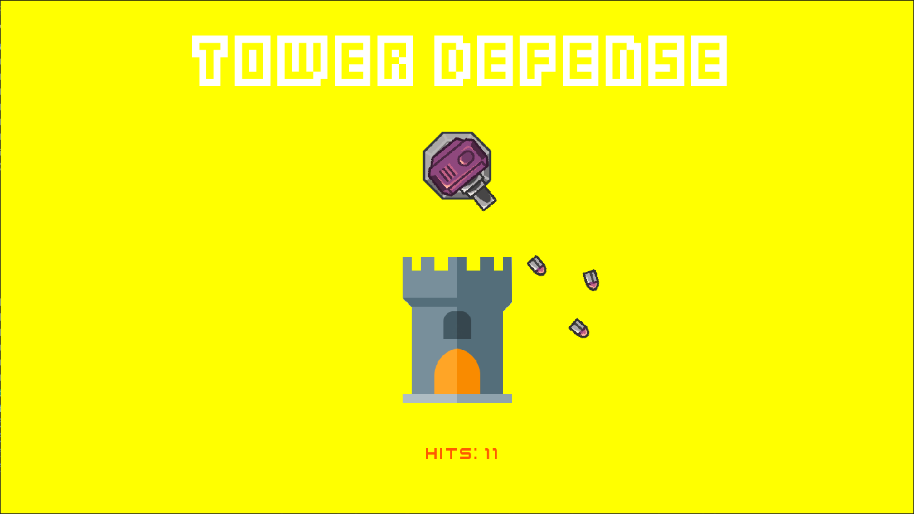
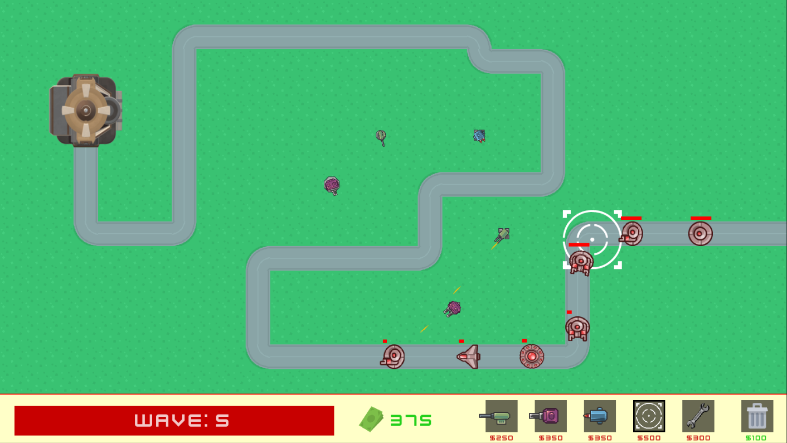
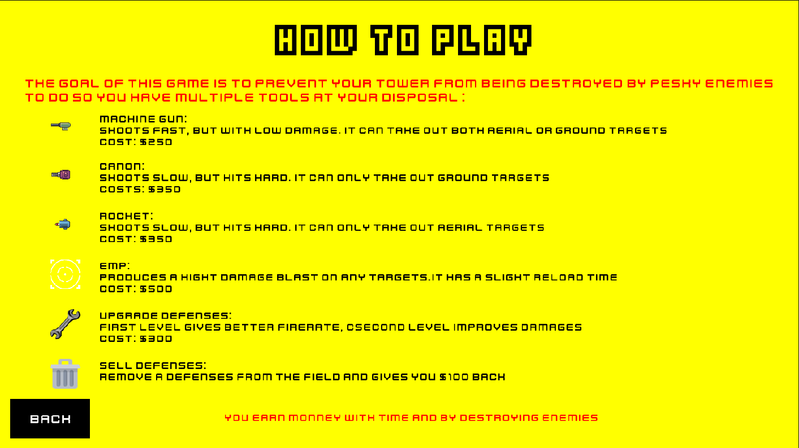

# My Defender

A [Tower Defense](https://en.wikipedia.org/wiki/Tower_defense) game coded in C using the [CSFML library](http://transit.iut2.upmf-grenoble.fr/doc/libcsfml-doc/html/)

*This is a school project, it may only work under a Unix environment and will require the [CSFML library](https://www.sfml-dev.org/download/csfml/index-fr.php) (we used version 2.5)*

### Description
This project goal of this project was to make a Tower Defense game with a convenient user interface.

The player is a builder who must defend his castle by placing down defenses to destroy the enemy forces.

It is a wave based game, the said waves are infinite, longer you survive, stronger your enemies will be.

The map on which you will play can be user defined (and created). You can learn more about how to create a map by taking a look at the `.legend` file or by executing the `./my_defender -h` command (if the source files are compiled).

### How to test it
First of all, you need to compile the source files, simply execute the `make` command.

Now you can launch the game by executing its binary:

`./my_defender [map.txt]`

*If a map isn't passed as a parameter, the game will automatically load the defaul (`bonus/default`)*

*Do you not know what the keybinds are or simply how to play? Take a look at the `How to play` in game menu.*

